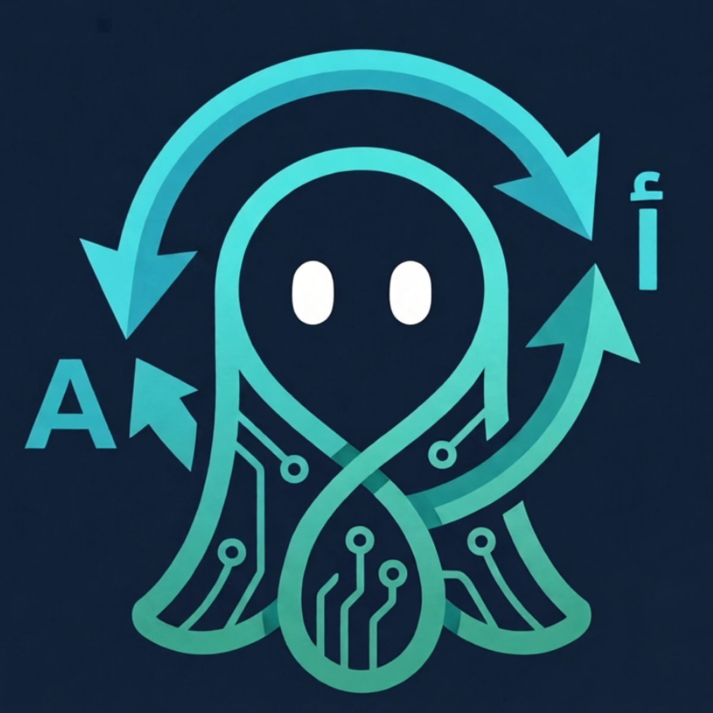

<div align="center">
  
  <h1>🐙 Layvix AI Pro</h1>
  <p><strong>The Intelligent Keyboard Layout Auto-Corrector for Windows</strong></p>
  
  [](https://opensource.org/licenses/MIT)
  []()
  []()
  []()
</div>

<br>

## 🌟 What is Layvix?

Have you ever typed a long sentence only to look up at your screen and realize your keyboard was in the wrong language? (e.g., typing Arabic on an English layout, resulting in gibberish like `lvpfh` instead of `مرحبا`).

**Layvix fixes this instantly and automatically.** 

It runs quietly in the background, analyzing your keystrokes using a **100% Pure Machine Learning Engine**. When it detects gibberish, it instantly deletes the wrong word, types the correct one, and switches your Windows keyboard language automatically so you can continue typing without skipping a beat.

---

## ✨ Core Features

- 🧠 **Pure AI Engine**: No static dictionaries! Layvix uses a trained `SGDClassifier` model that understands the mathematical patterns of character N-grams.
- ⚡ **Real-Time Auto-Correction**: Fixes your typing mistakes globally across any Windows application (Browsers, Discord, Word, etc.).
- 🔄 **Continuous Online Learning**: The AI adapts to YOU. If it makes a mistake and you undo it, it learns. Over time, it perfectly understands your unique slang, abbreviations, and vocabulary.
- 🎯 **Smart Selection Correction**: Highlight an entire messed-up sentence with your mouse, press the manual shortcut, and Layvix will translate the whole sentence in-place without ruining your clipboard.
- 🎮 **Gamer Mode**: Automatically detects when you launch a Fullscreen DirectX/Vulkan game (like Valorant or CS:GO) and pauses itself to ensure zero interference and 0% latency.
- 🎨 **Premium UI**: A gorgeous, glassmorphic dark-themed dashboard to monitor your AI stats, memory consumption, and custom dictionary.

---

## 🚀 Installation

Layvix is designed to be **100% Portable and Self-Contained**. You do not need to install Python or any libraries. 

1. Go to the [Releases](../../releases/latest) page.
2. Download `Layvix.exe`.
3. Double-click to run! (No installation wizard required).

> [!WARNING]
> **Windows SmartScreen (Unknown Publisher) Warning:**
> Since Layvix is an independent open-source project, it does not have a paid enterprise code-signing certificate. When you run it for the first time, Windows Defender SmartScreen might block it.
> **How to bypass:** Click **"More Info" (مزيد من المعلومات)** -> then click **"Run anyway" (تشغيل على أي حال)**.

### 🗑️ Uninstallation
Because Layvix is portable, uninstallation is extremely simple:
1. Right-click the Layvix Octopus icon in your system tray and select **"Quit"**.
2. Delete the `Layvix.exe` file.
3. (Optional) To delete your personal trained AI model and stats, delete the folder: `%APPDATA%\Layvix`.

---

## ⌨️ Keyboard Shortcuts

All shortcuts are globally customizable inside the app:

| Action | Default Shortcut | Description |
|--------|------------------|-------------|
| **Smart Undo** | `Ctrl + Alt + Shift + Z` | Reverts an auto-correction and **teaches the AI** never to correct that specific word again. |
| **Manual Fix** | `Ctrl + Alt + Shift + S` | Fixes the last typed word or a fully highlighted sentence instantly. |

---

## 🛠️ For Developers (Build from Source)

Want to contribute or build it yourself? 

1. Clone the repository:
   ```bash
   git clone https://github.com/salehalsalem/layvix.git
   cd layvix
   ```
2. Install requirements:
   ```bash
   pip install -r requirements.txt
   ```
3. Run the development version:
   ```bash
   python main.py
   ```
4. Compile your own `.exe` using PyInstaller:
   ```bash
   pyinstaller Layvix.spec
   ```

---

## 🏗️ Architecture

- `main.py`: The orchestrator and global low-level keyboard listener.
- `ai_engine.py`: Loads the `SGDClassifier` and predicts layout intent with real-time confidence scoring.
- `learner.py`: Handles `partial_fit` incremental learning to update your personal model on the fly.
- `game_detector.py`: Uses `SetWinEventHook` to monitor foreground window changes and detect exclusive fullscreen apps.
- `gui.py`: The PyQt6 modern frontend.

---

<div align="center">
  <i>Made with ❤️ by Saleh ALSalem</i>
</div>
